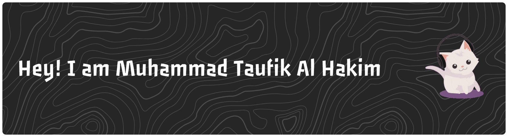

<!--
**taufikalhkim21/taufikalhkim21** is a ✨ _special_ ✨ repository because its `README.md` (this file) appears on your GitHub profile.

Here are some ideas to get you started:

- 🔭 I’m studying ...
- 🌱 I’m currently learning ...
- 👯 I’m looking to collaborate on ...
- 🤔 I’m looking for help with ...
- 💬 Ask me about ...
- 📫 How to reach me: ...
- 😄 Pronouns: ...
- ⚡ Fun fact: ...
- #### I’m studying ...
  

- #### My social media ...
 

-->

###

  
  
  

###

<h3 align="left">👩‍💻  About Me</h3>

###

I'm Muhammad Taufik Al Hakim  - I am a student at Suryakencana University - I'm currently learning HTML and CSS -  I want to be a reliable programmer

###

<h3 align="left">🛠 Language and tools</h3>

###

  
  
  
  
  
  
  
  
  

###

###